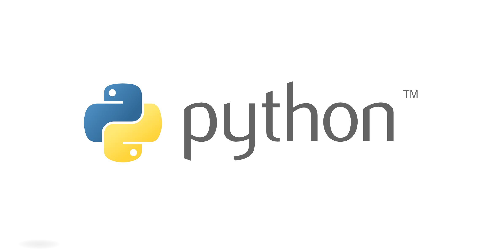

 

# TL;Dr Python

Covers the basics and some advanced concepts of python. Mainly focuses on Data structure and Algorithm implementation suing Python 3.

# Reference

[1]: Coding "Data Analysis and Agorihtms Made Easy by Narasimha Karumanchi" 

[2]: Theory "Fluent Python by Luciano Ramalho "

